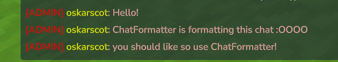

# ChatFormatter

A chat formatting plugin for Hytale servers that allows customizable message formats and phrase filtering.

> [!WARNING]
> This plugin is still in development. Things can change at short notice

## Features

- **Custom Chat Formatters** - Define different chat formats based on permission groups
- **Blocked Phrases** - Filter out unwanted words from chat messages
- **Rich Text Support** - Full support for colors, bold, italic, underline, and monospace styling



## Configuration

The plugin configuration is stored in JSON format:

### Messages

- `BlockedPhraseMessage` - The message shown when a user tries to send a blocked phrase
- `Formatters` - A list of chat formatters. The `Name` field should match a permission group name - when a player sends a message, the plugin will use the formatter matching one of their groups.

### Message Placeholders

- `{username}` - The player's username
- `{message}` - The chat message content

### BlockedPhrases

A list of words that will be blocked from chat.

## Example Configuration
```json
{
  "Messages": {
    "BlockedPhraseMessage": {
      "RawText": "Hey, you cannot say that!",
      "Bold": true,
      "Color": "#ff0000"
    },
    "Formatters": [
      {
        "Name": "OP",
        "Message": {
          "Children": [
            { "RawText": "[ADMIN] ", "Color": "#ff0000" },
            { "RawText": "{username}", "Color": "#ffff00" },
            { "RawText": ": {message}", "Color": "#ffafaf" }
          ]
        }
      }
    ]
  },
  "BlockedPhrases": ["badword1", "badword2"]
}
```